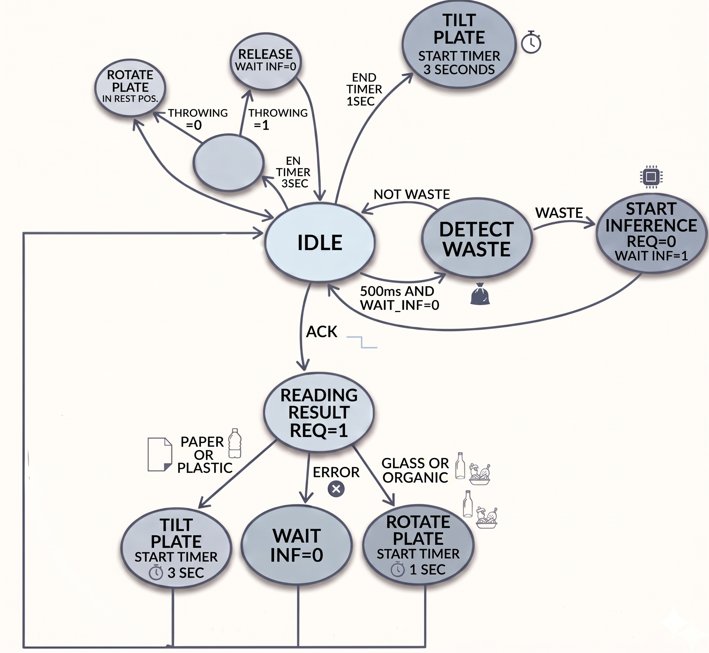
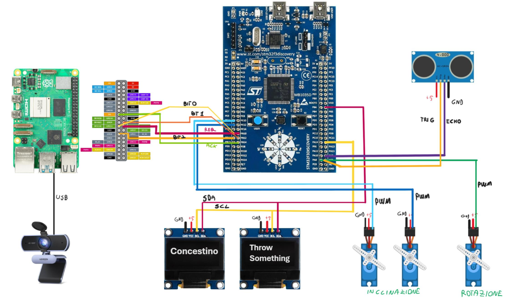

# ♻️ Smart system for separate waste collection

**Smart system for separate waste collection**

AI_BIN is a "smart" bin that automatically recognizes the material of an object placed on a movable plate and sorts it into the correct container (paper, plastic/metal, glass, organic). Recognition is performed by a neural network running locally on a **Raspberry Pi 5**, while real-time control of sensors and actuators is handled by an **STM32F303 Discovery**.


---

## 📑 Table of Contents

- [How it works](#-how-it-works)
- [Architecture](#-architecture)
- [Hardware components](#-hardware-components)
- [Wiring](#-wiring)
- [STM ↔ Raspberry communication protocol](#-stm--raspberry-communication-protocol)
- [STM32 firmware](#-stm32-firmware)
- [Raspberry Pi software](#-raspberry-pi-software)
- [Repository structure](#-repository-structure)
- [Installation and startup](#-installation-and-startup)
- [Documentation](#-documentation)
- [Authors](#-authors)

---

## 🔎 How it works

The problem: waste sorting depends entirely on human attention. Concestino automates it.

1. **Detection** – The HC-SR04 ultrasonic sensor measures the distance from the plate every 500 ms. If the distance drops below a threshold, an object is detected.
2. **Inference request** – The STM32 pulls the `REQ` signal low and shows `THINKING...` on the display.
3. **Classification** – The Raspberry waits 2.5 s (to give time to remove your hand), takes a photo with the webcam, crops the plate area and runs inference.
4. **Response** – The result is encoded on 3 bits on a parallel bus and the Raspberry pulls `ACK` low.
5. **Sorting** – The STM32 reads the result and moves the servomotors: the plate tilts toward the correct bin (with a preliminary rotation for glass and organic).
6. **Reset** – After 3 s the plate returns to its rest position, and for another 3 s measurements stay blocked, to avoid false detections caused by oscillations.

### Operating cycle state machine


<div align="center">
    
</div>   


---

## 🏗️ Architecture

<div align="center">
    
</div>  

| Module | Hardware | Role |
|---|---|---|
| **Vision** | Raspberry Pi 5 + USB webcam | Image acquisition and local AI inference |
| **Control** | STM32F303 Discovery | Real-time management of sensors, PWM actuators and communication between peripherals |
| **Mechanical** | HC-SR04 + servomotors + OLED display | Object detection, mechanical unloading, visual feedback |

### Why these choices

| Component | Rationale |
|---|---|
| Raspberry Pi 5 | Sufficient computing power for inference and USB support for the webcam |
| I2C | Simple and well suited to OLED displays |
| Parallel interface | Minimal latency, simplicity in transferring the result, dedicated STM–Raspberry connection |
| Ultrasonic sensor | Detects an object regardless of its color and returns a measurement that can be converted to distance |
| SG90 servomotor | Simple movement/tilting of the plate via a PWM signal |

---

## 🔧 Hardware components

- 1× Raspberry Pi 5
- 1× STM32F303 Discovery (STM32F303VCT6)
- 1× HC-SR04 ultrasonic sensor
- 2× 128×64 OLED displays (SSD1306, I2C)
- 3× SG90 servomotors
- 1× USB webcam
- Mechanical structure: tilting plate, webcam support and three containers (paper, plastic/metal, glass/organic)

---

## 🔌 Wiring

### STM32 ↔ Raspberry Pi bus

| Signal | Raspberry Pi (BCM) | STM32 | Direction |
|---|---|---|---|
| `REQ` | GPIO 24 | PB10 | STM → RPi (output on STM, high at rest) |
| `ACK` | GPIO 17 | PB14 | RPi → STM (EXTI on falling edge) |
| `bit0` | GPIO 23 | PB11 | RPi → STM |
| `bit1` | GPIO 22 | PB12 | RPi → STM |
| `bit2` | GPIO 27 | PB13 | RPi → STM |

> ⚠️ Also connect a common **ground (GND)** between the Raspberry and the STM32.

### Other STM32 peripherals

| Peripheral | Pin / Resource |
|---|---|
| HC-SR04 `ECHO` | PA9 (EXTI, rising and falling edges) |
| HC-SR04 `TRIG` | PC9 (output) |
| OLED display | I2C1 (SCL/SDA), Fast Mode 400 kHz |
| Plate rotation servo | TIM1 CH1 |
| Plate tilt servo | TIM1 CH2 and CH3 |

The complete wiring diagram is in the slides in [`docs/`](docs/).

### Result encoding (3 bits)

| Class | `bit2` `bit1` `bit0` | Value |
|---|:---:|:---:|
| Error / unknown | `0 0 0` | 0 |
| Paper | `0 0 1` | 1 |
| Plastic / Metal | `0 1 0` | 2 |
| Glass | `0 1 1` | 3 |
| Organic | `1 0 0` | 4 |

The model's `plastic` and `metal` classes are merged into a single *plast/met* category.

---

## 🤝 STM ↔ Raspberry communication protocol

A two-wire handshake (`REQ`/`ACK`) plus a 3-bit data bus:

1. `REQ` is normally high. The STM **pulls it low** when it detects waste.
2. The Raspberry sees `REQ` low, **raises `ACK`**, waits, takes the photo and runs inference.
3. The Raspberry writes the result on `bit0..bit2`.
4. The Raspberry **pulls `ACK` low** → falling edge → EXTI interrupt on the STM.
5. In the callback, the STM reads the 3 bits, **raises `REQ` again** and calls `throw()`.

---

## ⚙️ STM32 firmware

**STM32CubeIDE** project (HAL) for the STM32F303VCT6, in [`stm32/MGLM_V1/`](stm32/MGLM_V1/).

### Peripheral configuration

| Resource | Configuration | Use |
|---|---|---|
| **System clock** | HSE 8 MHz → PLL ×9 = **72 MHz** | Maximum frequency |
| **TIM1** | PSC = 71 → 1 MHz, ARR = 19999 → **50 Hz** | PWM for the 3 servomotors (CH1 rotation, CH2/CH3 tilt) |
| **TIM2** | PSC = 71 → 1 MHz | Measuring the ECHO pulse duration |
| **TIM3** | PSC = 9999 → 7200 Hz, ARR = 21599 → **3 s** | Unloading wait + plate stabilization |
| **TIM4** | PSC = 9999 → 7200 Hz, ARR = 7199 → **1 s** | Wait after plate rotation |
| **I2C1** | Fast Mode, 400 kHz | Two SSD1306 OLED displays |
| **EXTI [9:5]** | PA9 | Sensor `ECHO` |
| **EXTI [15:10]** | PB14 | `ACK` from the Raspberry |

### Distance measurement

On the rising edge of `ECHO` the TIM2 counter is reset/saved, and on the falling edge the final value is read:

```c
distance = (echo_stop - echo_start) * 0.034 / 2;   // cm
```

The distance is saturated at 30 cm to handle overflow; if it is below the `threshold`, inference is started.

### OLED displays: hardware modification of the I2C address

The two OLED displays are identical and, from the factory, share the same I2C address. To tell them apart, a **physical modification** was made on the back of the PCB of one of them: the address-selection resistor was moved from `0x78` to `0x7A`.

- Display 1 (`0x78`): status messages (`THROW SOMETHING`, `THINKING...`, recognized class)
- Display 2 (`0x7A`): the `CONCESTINO` text

SSD1306 driver based on [`ssd1306.c/h`](stm32/MGLM_V1/Core/Src/) with multi-display support.

---

## 🧠 Raspberry Pi software

The script [`raspberry/RaspberryCODE.py`](raspberry/RaspberryCODE.py) listens on `REQ` and, for each request:

1. Raises `ACK` and waits 2.5 s (time to remove your hand from the plate).
2. Opens the webcam, waits 0.5 s for focus and captures a frame.
3. **Crops** the central region corresponding to the plate.
4. Converts BGR → RGB and applies the transforms (Resize 256, CenterCrop 224, ImageNet normalization).
5. Runs inference with a **TorchScript** model and computes the softmax.
6. Maps the class to the 3-bit code, writes it on the bus and pulls `ACK` low.
7. Saves the frame used for inference to `res.jpg` (useful for debugging: shows what the model "sees").

**Model classes:** `glass`, `metal`, `organic`, `paper`, `plastic`

> 📦 The model file (`modello_rifiuti_v3.pt`) is **not included** in the repository. It must be placed in `./APC/modello_rifiuti_v3.pt`, or the `PERCORSO_MODELLO` constant in the script must be changed.

---

## 📁 Repository structure

```
concestino/
├── README.md
├── .gitignore
├── docs/
│   ├── Concestino.pdf          # project presentation slides
│   └── images/                 # photos and diagrams
├── raspberry/
│   ├── RaspberryCODE.py        # acquisition + inference + handshake script
│   └── APC/
│       └── modello_rifiuti_v3.pt   # (not included)
└── stm32/
    └── MGLM_V1/                # STM32CubeIDE project
        ├── MGLM_V1.ioc         # CubeMX configuration
        ├── Core/
        │   ├── Inc/
        │   └── Src/main.c
        └── Drivers/
```

---

## 🚀 Installation and startup

### 1. STM32 firmware

1. Open **STM32CubeIDE** and import the project: `File → Open Projects from File System…` → `stm32/MGLM_V1`.
2. Connect the STM32F303 Discovery via USB (ST-LINK).
3. Build and flash with `Run` / `Debug`.

### 2. Raspberry Pi

Requirements: **Python ≥ 3.10** (the script uses `match/case`).

```bash
cd raspberry
python3 -m venv .venv
source .venv/bin/activate

pip install torch torchvision opencv-python pillow
pip install rpi-lgpio        # on Raspberry Pi 5: provides a compatible implementation of RPi.GPIO
```

> ℹ️ On the **Raspberry Pi 5** the classic `RPi.GPIO` package does not work because the GPIO controller has changed: `rpi-lgpio` is a drop-in replacement that keeps the same `import RPi.GPIO as GPIO`.

Run:

```bash
python3 RaspberryCODE.py
```

The script keeps running in an infinite loop, waiting for requests from the STM32. For automatic startup at boot, a `systemd` service can be used.

### 3. Power-up and test

1. Power on the STM32 and the Raspberry (common GND).
2. The displays show `THROW SOMETHING` / `CONCESTINO`.
3. Place an object on the plate and move your hand away: after classification, the plate tilts toward the correct bin.

---

## 🛠️ Possible improvements

- Replace the fixed crop (hard-coded coordinates) with a configurable calibration.
- Add a minimum confidence threshold: below it, return the error code instead of forcing a class.
- Keep the webcam open between requests to reduce latency.
- Handle the `ret == False` case after `cap.read()`.
- Add a fill-level sensor for each container.

---

## 📚 Documentation

The full project slides (architecture, wiring diagrams, timing diagrams, timer and NVIC configuration, code excerpts) are available in [`docs/Concestino.pdf`](docs/Concestino.pdf).

---

## 👥 Authors

- **Marco Sciaudone**
- **Mattia Verrillo**
- **Giulio Paesano**
- **Laura Verdosci**

Project for the course *Computer Architecture and Design* (Architettura e Progetto dei Calcolatori) – MSc in Computer Engineering.

---
